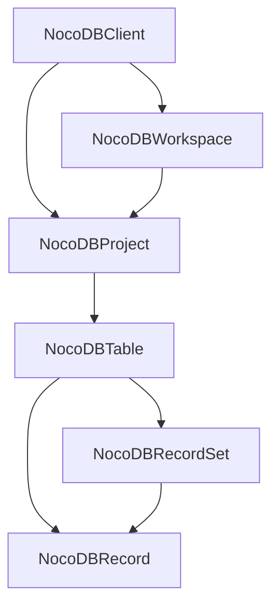
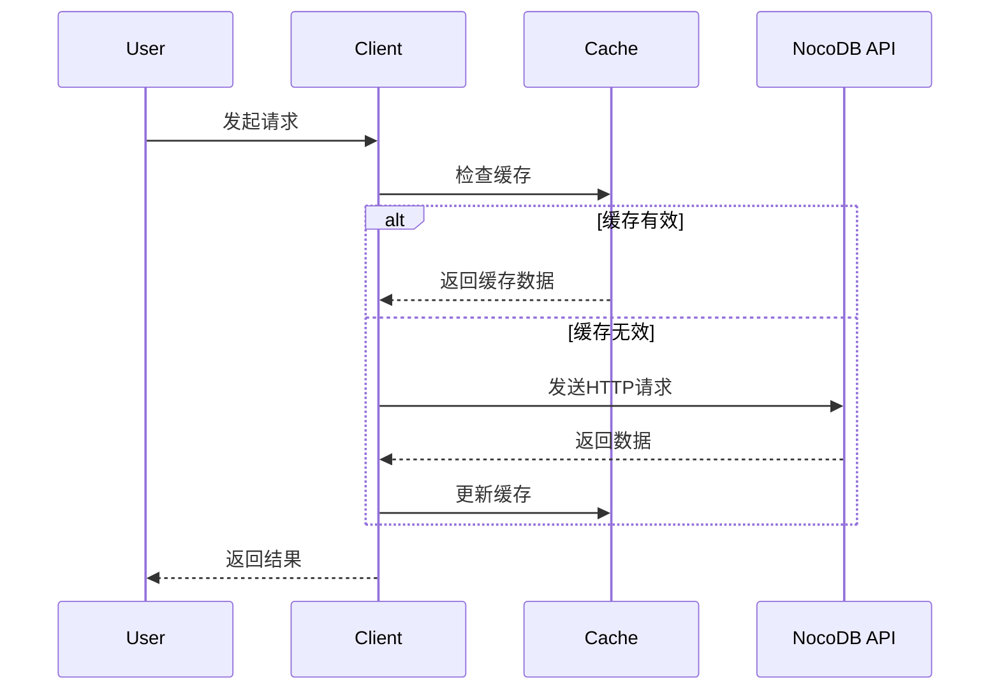
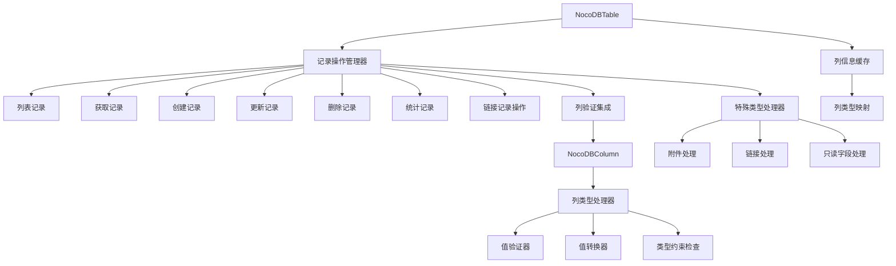
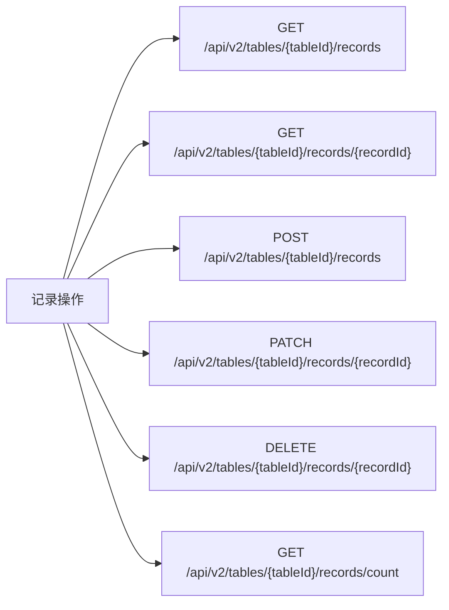
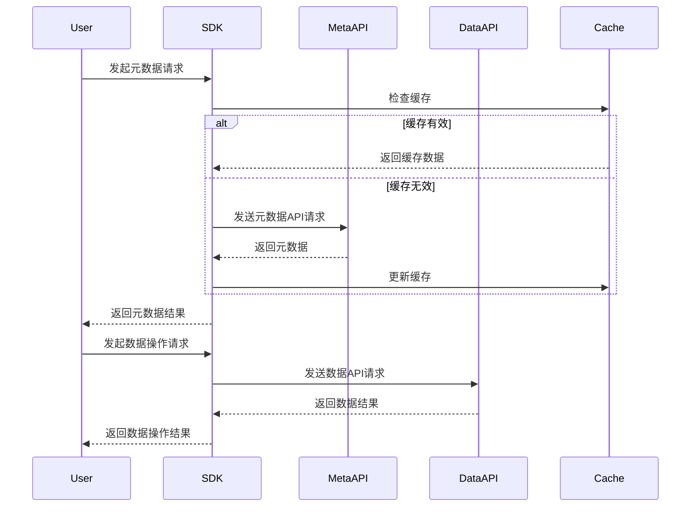

# NocoDB Python SDK 系统架构

## 系统架构概述
NocoDB Python SDK 采用分层架构设计，包含四个核心类，按照工作区→项目→表格的层次结构组织。系统支持自托管和云实例两种部署模式，内置智能缓存机制以提高性能。

## 核心组件架构

### 分层架构图

### 核心类关系
- **NocoDBClient**: 顶层客户端，管理项目连接和认证
- **NocoDBWorkspace**: 工作区管理（仅限云实例）
- **NocoDBProject**: 项目管理，包含表格操作
- **NocoDBTable**: 表格管理，包含列和数据操作
- **NocoDBColumn**: 列管理，包含列类型验证和转换功能
- **NocoDBRecord**: 记录对象，封装记录数据和元数据，支持在线/离线状态管理
- **NocoDBRecordSet**: 记录集合，封装多个记录和集合操作

## 源代码路径

### 主要模块
- [`src/nocodb_py/client.py`](../../../src/nocodb_py/client.py) - 主客户端类，处理基础API调用和缓存
- [`src/nocodb_py/workspace.py`](../../../src/nocodb_py/workspace.py) - 工作区管理类（云实例专用）
- [`src/nocodb_py/project.py`](../../../src/nocodb_py/project.py) - 项目管理类
- [`src/nocodb_py/table.py`](../../../src/nocodb_py/table.py) - 表格管理类
- [`src/nocodb_py/column.py`](../../../src/nocodb_py/column.py) - 列管理类，包含列类型验证和转换功能
- [`src/nocodb_py/record.py`](../../../src/nocodb_py/record.py) - 记录管理类，包含记录对象和记录集合
- [`src/nocodb_py/utils.py`](../../../src/nocodb_py/utils.py) - 工具函数
- [`src/nocodb_py/variable.py`](../../../src/nocodb_py/variable.py) - 配置变量

### 入口点
- [`src/nocodb_py/__init__.py`](../../../src/nocodb_py/__init__.py) - 包初始化，导出核心类

## 关键技术决策

### 缓存机制
- 使用线程安全的RLock实现缓存同步
- 支持TTL（Time To Live）配置
- 分层缓存：客户端级、工作区级、项目级、表格级
- 支持强制刷新缓存

### API路径设计
- 自托管实例：直接使用基础URL
- 云实例：使用工作区ID构建API路径前缀
- 统一使用 `/api/v1` 和 `/api/v2` 端点
- V2 API路径结构：`/api/v2/meta/{resource}`

### 错误处理策略
- 使用requests库的异常处理
- 统一的HTTP状态码检查
- 类型安全的返回值处理
- 适应V2 API的错误响应格式

### V2 API功能支持
- **项目管理**：已实现项目创建功能，其他CRUD操作待实现
- **表格管理**：表格元数据获取功能已实现，创建、更新和删除功能待实现
- **视图管理**：网格视图、表单视图、画廊视图、看板视图（待实现）
- **列操作**：列管理框架已创建，基础列信息获取功能已实现，完整CRUD操作待实现
- **数据操作**：基础记录CRUD操作已实现（列表、获取、创建、更新、删除、统计记录），列类型验证系统和特殊类型处理待完善
- **过滤器和排序**：视图级别的条件过滤和排序规则（待实现）
- **数据源管理**：多数据源支持和管理（待实现）
- **用户和权限**：项目用户管理和角色分配（待实现）
- **评论系统**：行级别评论功能（待实现）
- **Webhooks**：表钩子管理和事件触发（待实现）
- **API令牌**：令牌创建和管理（待实现）

## 设计模式应用

### 组合模式
- 客户端包含工作区和项目
- 项目包含表格
- 表格包含列和数据
- 列包含类型验证和转换逻辑

### 策略模式
- 不同的部署模式（自托管 vs 云实例）使用不同的API路径策略
- 缓存策略可配置TTL

### 工厂模式
- 通过客户端方法创建工作区、项目、表格对象

### 拷贝与序列化
- 核心类实现`__copy__`、`__deepcopy__`、`__getstate__`、`__setstate__`方法
- 拷贝时自动重置缓存状态，保持对象独立性
- 支持pickle序列化，正确处理线程锁和缓存状态

## 关键实现路径

### 客户端初始化流程
1. 设置基础URL和认证令牌
2. 配置缓存参数
3. 初始化缓存锁和数据结构

### API调用流程
1. 检查缓存有效性
2. 获取缓存锁
3. 执行HTTP请求
4. 更新缓存
5. 返回结果

### 数据流架构

## 组件关系

### 依赖关系
- NocoDBWorkspace 继承自 NocoDBClient
- NocoDBProject 依赖于 NocoDBClient
- NocoDBTable 依赖于 NocoDBProject
- NocoDBRecordSet 依赖于 NocoDBTable
- NocoDBRecord 独立存在，可通过table_id与表关联

### 数据流关系
- 客户端管理基础认证和连接
- 工作区管理云实例的多租户隔离
- 项目作为数据组织的核心单元
- 表格作为数据存储和操作的基本单位
- 记录集合封装多个记录和集合操作
- 记录作为数据容器，支持在线/离线状态管理
- 列作为数据验证和类型转换的核心组件

## V2 API架构扩展

### 当前实现状态
- **已实现功能**：
  - 项目创建（自托管和云实例）
  - 表格元数据获取
  - 列基本信息获取
  - 基础记录CRUD操作（列表、获取、创建、更新、删除、统计记录）
  - 部署模式差异处理（自托管 vs 云实例）
  - 错误处理机制适配V2 API格式
  - 分层缓存机制支持V2 API
  - 拷贝和序列化支持
  
- **待实现功能**：
  - 项目管理CRUD（获取、更新、删除）
  - 表格操作（创建、更新、删除）
  - 视图管理（网格、表单、画廊、看板视图）
  - 列操作（创建、更新、删除、主值设置）
  - 数据操作（记录CRUD、链接记录、附件上传等） - **已有详细实施计划**
  - 过滤器、排序、Webhooks等高级功能

### 功能模块划分

```mermaid
graph TD
    A[V2 API支持] --> B[元数据管理]
    A --> C[数据操作]
    
    B --> B1[项目管理]
    B --> B2[表格管理]
    B --> B3[视图管理]
    B --> B4[列操作]
    B --> B5[过滤器排序]
    B --> B6[数据源管理]
    B --> B7[用户权限]
    B --> B8[评论系统]
    B --> B9[Webhooks]
    B --> B10[API令牌]
    
    C --> C1[记录CRUD]
    C --> C2[链接记录]
    C --> C3[附件管理]
    C --> C4[列类型验证]
    C --> C5[特殊类型处理]
    
    B1 --> B11[列表项目]
    B1 --> B12[创建项目]
    B1 --> B13[获取项目]
    B1 --> B14[更新项目]
    B1 --> B15[删除项目]
    
    B2 --> B21[列表表格]
    B2 --> B22[创建表格]
    B2 --> B23[获取表格元数据]
    B2 --> B24[更新表格]
    B2 --> B25[删除表格]
    
    B3 --> B31[网格视图]
    B3 --> B32[表单视图]
    B3 --> B33[画廊视图]
    B3 --> B34[看板视图]
    
    C1 --> C11[列出记录]
    C1 --> C12[创建记录]
    C1 --> C13[读取记录]
    C1 --> C14[更新记录]
    C1 --> C15[删除记录]
    C1 --> C16[统计记录]
    
    C2 --> C21[列出链接]
    C2 --> C22[链接记录]
    C2 --> C23[取消链接]
    
    C4 --> C41[基础类型验证]
    C4 --> C42[选择类型验证]
    C4 --> C43[验证类型处理]
    C4 --> C44[特殊类型处理]
    
    C5 --> C51[附件处理]
    C5 --> C52[链接处理]
    C5 --> C53[只读字段处理]
    C5 --> C54[系统字段处理]
```

### 记录操作架构扩展

#### 核心组件关系

#### 记录操作API端点映射

### API端点映射

#### 元数据API端点 (`/api/v2/meta/`)
- **项目操作**：`/api/v2/meta/bases/` 和 `/api/v2/meta/workspaces/{workspaceId}/bases/`
- **表格操作**：`/api/v2/meta/bases/{baseId}/tables` 和 `/api/v2/meta/tables/{tableId}`
- **视图操作**：`/api/v2/meta/tables/{tableId}/views` 和 `/api/v2/meta/views/{viewId}`
- **列操作**：`/api/v2/meta/tables/{tableId}/columns` 和 `/api/v2/meta/columns/{columnId}`
- **过滤器操作**：`/api/v2/meta/views/{viewId}/filters` 和 `/api/v2/meta/filters/{filterId}`
- **排序操作**：`/api/v2/meta/views/{viewId}/sorts` 和 `/api/v2/meta/sorts/{sortId}`
- **数据源管理**：`/api/v2/meta/bases/{baseId}/sources/`
- **用户管理**：`/api/v2/meta/bases/{baseId}/users`
- **评论系统**：`/api/v2/meta/comments`
- **Webhooks管理**：`/api/v2/meta/tables/{tableId}/hooks`
- **API令牌管理**：`/api/v2/meta/bases/{baseId}/api-tokens`

#### 数据API端点 (`/api/v2/`)
- **记录操作**：`/api/v2/tables/{tableId}/records` (CRUD操作)
- **链接记录**：`/api/v2/tables/{tableId}/links/{linkFieldId}/records/{recordId}`
- **附件上传**：`/api/v2/storage/upload`
- **记录统计**：`/api/v2/tables/{tableId}/records/count`

## 列分类架构

基于对NocoDB列模型的深入分析，识别出三类特殊列，这些列在记录操作中需要特殊处理：

### 1. 系统列（System Columns）
- **定义**：由NocoDB系统自动生成，值完全由系统控制，用户无法修改。
- **特征**：
  - `system` 字段值为 1
  - `readonly` 字段可能为 0 或 1（但实际行为为只读）
  - 通常具有特定的 `uidt` 值
- **典型列**：
  | 列标题 | `uidt` | 说明 |
  |--------|--------|------|
  | Id | "ID" | 主键，自增整数，每张表有且仅有一个 |
  | CreatedAt | "CreatedTime" | 记录创建时间 |
  | UpdatedAt | "LastModifiedTime" | 记录最后修改时间 |
  | nc_created_by | "CreatedBy" | 创建者用户ID |
  | nc_updated_by | "LastModifiedBy" | 最后修改者用户ID |
  | nc_order | "Order" | 排序字段 |
- **处理策略**：
  - 在创建/更新记录时自动忽略这些字段
  - 读取时返回系统生成的值
  - 不可通过SDK修改

### 2. 用户定义的值只读列（User-defined Read-only Columns）
- **定义**：由用户创建，但值由系统计算或生成，用户无法直接修改值（但列元数据如标题、描述可修改）。
- **特征**：
  - `system` 字段值为 0
  - `readonly` 字段可能为 0 或 1（但实际行为为只读）
  - 特定的 `uidt` 值表示计算类型
- **典型列**：
  - **计算型**：Formula（公式）、Lookup（查找）、Rollup（汇总）
  - **生成型**：QrCode（二维码）、Barcode（条形码）、Button（按钮）
  - **时间/用户型**：CreatedTime、LastModifiedTime、CreatedBy、LastModifiedBy（用户自定义版本）
- **处理策略**：
  - 在创建/更新记录时自动忽略这些字段
  - 读取时返回系统计算的值
  - 允许通过列元数据API修改列属性（标题、描述等）

### 3. 链接列（Link Columns）
- **定义**：由用户创建Links列时，系统自动衍生的LinkToAnotherRecord列，用于表示表间关系。
- **特征**：
  - 两种列类型：`Links`（uidt "Links"）和 `LinkToAnotherRecord`（uidt "LinkToAnotherRecord"）
  - `virtual` 字段可能为 1
  - 值表示关联记录的数量或详情
- **典型列**：
  - **Links列**：用户定义的关联字段（如 test_m2m_link）
  - **LinkToAnotherRecord列**：系统自动生成的关联字段（如 nc_8cu0___nc_m2m_Table_1_Table_2s）
- **处理策略**：
  - 值只读，不能直接修改
  - 必须通过专门的链接记录API（`/api/v2/tables/{tableId}/links/{linkFieldId}/records/{recordId}`）管理关系
  - 在创建/更新记录时自动忽略这些字段

### 架构影响
1. **列信息缓存**：需要缓存列的分类信息，以在记录操作时快速识别特殊列。
2. **记录操作过滤**：在创建和更新记录时，自动过滤掉三类特殊列，避免API错误。
3. **链接记录管理**：提供专门的链接操作方法，集成到NocoDBTable类中。
4. **错误处理**：当用户尝试修改只读列时，提供清晰的错误信息。

### 数据流架构扩展
