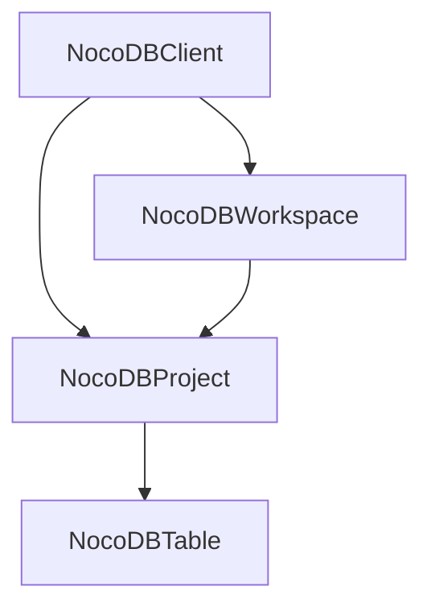
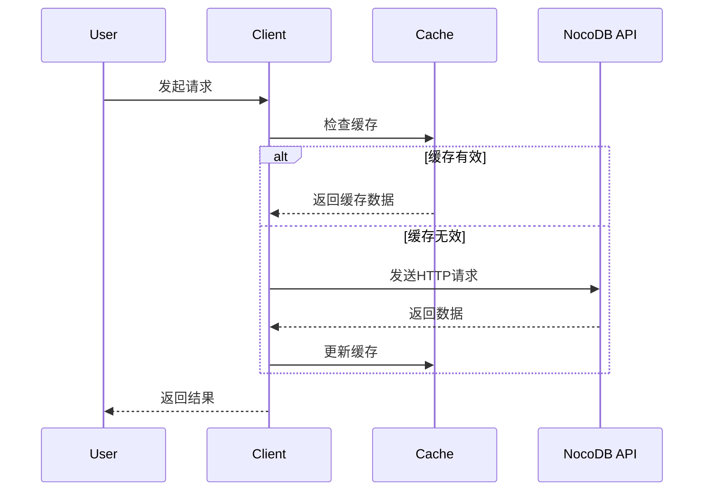
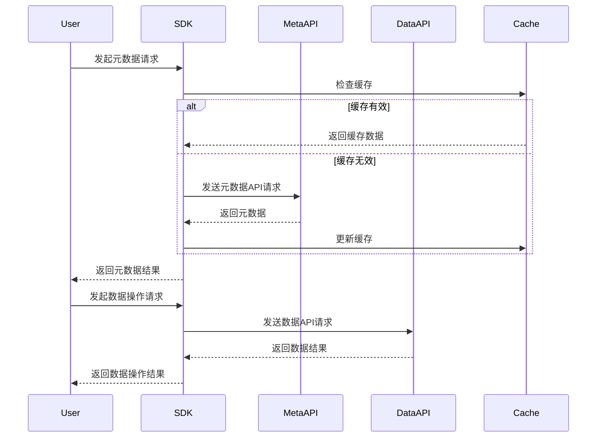

# NocoDB Python SDK 系统架构

## 系统架构概述
NocoDB Python SDK 采用分层架构设计，包含四个核心类，按照工作区→项目→表格的层次结构组织。系统支持自托管和云实例两种部署模式，内置智能缓存机制以提高性能。

## 核心组件架构

### 分层架构图

### 核心类关系
- **NocoDBClient**: 顶层客户端，管理项目连接和认证
- **NocoDBWorkspace**: 工作区管理（仅限云实例）
- **NocoDBProject**: 项目管理，包含表格操作
- **NocoDBTable**: 表格管理，包含列和数据操作

## 源代码路径

### 主要模块
- [`src/nocodb_py/client.py`](../../../src/nocodb_py/client.py) - 主客户端类，处理基础API调用和缓存
- [`src/nocodb_py/workspace.py`](../../../src/nocodb_py/workspace.py) - 工作区管理类（云实例专用）
- [`src/nocodb_py/project.py`](../../../src/nocodb_py/project.py) - 项目管理类
- [`src/nocodb_py/table.py`](../../../src/nocodb_py/table.py) - 表格管理类
- [`src/nocodb_py/utils.py`](../../../src/nocodb_py/utils.py) - 工具函数
- [`src/nocodb_py/variable.py`](../../../src/nocodb_py/variable.py) - 配置变量

### 入口点
- [`src/nocodb_py/__init__.py`](../../../src/nocodb_py/__init__.py) - 包初始化，导出核心类

## 关键技术决策

### 缓存机制
- 使用线程安全的RLock实现缓存同步
- 支持TTL（Time To Live）配置
- 分层缓存：客户端级、工作区级、项目级、表格级
- 支持强制刷新缓存

### API路径设计
- 自托管实例：直接使用基础URL
- 云实例：使用工作区ID构建API路径前缀
- 统一使用 `/api/v1` 和 `/api/v2` 端点
- V2 API路径结构：`/api/v2/meta/{resource}`

### 错误处理策略
- 使用requests库的异常处理
- 统一的HTTP状态码检查
- 类型安全的返回值处理
- 适应V2 API的错误响应格式

### V2 API功能支持
- **项目管理**：完整的CRUD操作，支持自托管和云实例
- **表格管理**：表格创建、元数据获取、更新和删除
- **视图管理**：网格视图、表单视图、画廊视图、看板视图
- **列操作**：列创建、更新、删除、主值设置
- **过滤器和排序**：视图级别的条件过滤和排序规则
- **数据源管理**：多数据源支持和管理
- **用户和权限**：项目用户管理和角色分配
- **评论系统**：行级别评论功能
- **Webhooks**：表钩子管理和事件触发
- **API令牌**：令牌创建和管理

## 设计模式应用

### 组合模式
- 客户端包含工作区和项目
- 项目包含表格
- 表格包含列和数据

### 策略模式
- 不同的部署模式（自托管 vs 云实例）使用不同的API路径策略
- 缓存策略可配置TTL

### 工厂模式
- 通过客户端方法创建工作区、项目、表格对象

## 关键实现路径

### 客户端初始化流程
1. 设置基础URL和认证令牌
2. 配置缓存参数
3. 初始化缓存锁和数据结构

### API调用流程
1. 检查缓存有效性
2. 获取缓存锁
3. 执行HTTP请求
4. 更新缓存
5. 返回结果

### 数据流架构

## 组件关系

### 依赖关系
- NocoDBWorkspace 继承自 NocoDBClient
- NocoDBProject 依赖于 NocoDBClient
- NocoDBTable 依赖于 NocoDBProject

### 数据流关系
- 客户端管理基础认证和连接
- 工作区管理云实例的多租户隔离
- 项目作为数据组织的核心单元
- 表格作为数据存储和操作的基本单位

## V2 API架构扩展

### 功能模块划分

```mermaid
graph TD
    A[V2 API支持] --> B[元数据管理]
    A --> C[数据操作]
    
    B --> B1[项目管理]
    B --> B2[表格管理]
    B --> B3[视图管理]
    B --> B4[列操作]
    B --> B5[过滤器排序]
    B --> B6[数据源管理]
    B --> B7[用户权限]
    B --> B8[评论系统]
    B --> B9[Webhooks]
    B --> B10[API令牌]
    
    C --> C1[记录CRUD]
    C --> C2[链接记录]
    C --> C3[附件管理]
    
    B1 --> B11[列表项目]
    B1 --> B12[创建项目]
    B1 --> B13[获取项目]
    B1 --> B14[更新项目]
    B1 --> B15[删除项目]
    
    B2 --> B21[列表表格]
    B2 --> B22[创建表格]
    B2 --> B23[获取表格元数据]
    B2 --> B24[更新表格]
    B2 --> B25[删除表格]
    
    B3 --> B31[网格视图]
    B3 --> B32[表单视图]
    B3 --> B33[画廊视图]
    B3 --> B34[看板视图]
    
    C1 --> C11[列出记录]
    C1 --> C12[创建记录]
    C1 --> C13[读取记录]
    C1 --> C14[更新记录]
    C1 --> C15[删除记录]
    C1 --> C16[统计记录]
    
    C2 --> C21[列出链接]
    C2 --> C22[链接记录]
    C2 --> C23[取消链接]
```

### API端点映射

#### 元数据API端点 (`/api/v2/meta/`)
- **项目操作**：`/api/v2/meta/bases/` 和 `/api/v2/meta/workspaces/{workspaceId}/bases/`
- **表格操作**：`/api/v2/meta/bases/{baseId}/tables` 和 `/api/v2/meta/tables/{tableId}`
- **视图操作**：`/api/v2/meta/tables/{tableId}/views` 和 `/api/v2/meta/views/{viewId}`
- **列操作**：`/api/v2/meta/tables/{tableId}/columns` 和 `/api/v2/meta/columns/{columnId}`
- **过滤器操作**：`/api/v2/meta/views/{viewId}/filters` 和 `/api/v2/meta/filters/{filterId}`
- **排序操作**：`/api/v2/meta/views/{viewId}/sorts` 和 `/api/v2/meta/sorts/{sortId}`
- **数据源管理**：`/api/v2/meta/bases/{baseId}/sources/`
- **用户管理**：`/api/v2/meta/bases/{baseId}/users`
- **评论系统**：`/api/v2/meta/comments`
- **Webhooks管理**：`/api/v2/meta/tables/{tableId}/hooks`
- **API令牌管理**：`/api/v2/meta/bases/{baseId}/api-tokens`

#### 数据API端点 (`/api/v2/`)
- **记录操作**：`/api/v2/tables/{tableId}/records` (CRUD操作)
- **链接记录**：`/api/v2/tables/{tableId}/links/{linkFieldId}/records/{recordId}`
- **附件上传**：`/api/v2/storage/upload`
- **记录统计**：`/api/v2/tables/{tableId}/records/count`

### 数据流架构扩展
