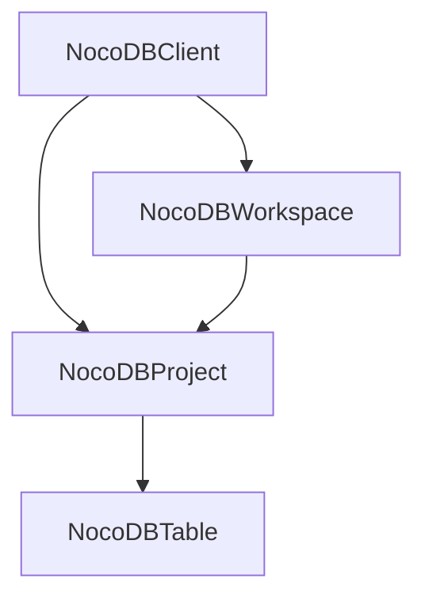
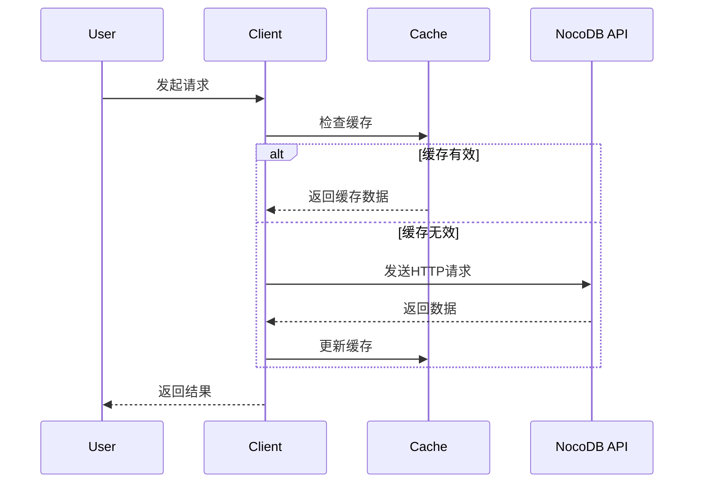

# NocoDB Python SDK 系统架构

## 系统架构概述
NocoDB Python SDK 采用分层架构设计，包含四个核心类，按照工作区→项目→表格的层次结构组织。系统支持自托管和云实例两种部署模式，内置智能缓存机制以提高性能。

## 核心组件架构

### 分层架构图

### 核心类关系
- **NocoDBClient**: 顶层客户端，管理基础连接和认证
- **NocoDBWorkspace**: 工作区管理（仅限云实例）
- **NocoDBProject**: 项目管理，包含表格操作
- **NocoDBTable**: 表格管理，包含列和数据操作

## 源代码路径

### 主要模块
- [`src/nocodb_py/client.py`](src/nocodb_py/client.py:1) - 主客户端类，处理基础API调用和缓存
- [`src/nocodb_py/workspace.py`](src/nocodb_py/workspace.py:1) - 工作区管理类（云实例专用）
- [`src/nocodb_py/project.py`](src/nocodb_py/project.py:1) - 项目管理类
- [`src/nocodb_py/table.py`](src/nocodb_py/table.py:1) - 表格管理类
- [`src/nocodb_py/utils.py`](src/nocodb_py/utils.py:1) - 工具函数
- [`src/nocodb_py/variable.py`](src/nocodb_py/variable.py:1) - 配置变量

### 入口点
- [`src/nocodb_py/__init__.py`](src/nocodb_py/__init__.py:1) - 包初始化，导出核心类

## 关键技术决策

### 缓存机制
- 使用线程安全的RLock实现缓存同步
- 支持TTL（Time To Live）配置
- 分层缓存：客户端级、工作区级、项目级、表格级
- 支持强制刷新缓存

### API路径设计
- 自托管实例：直接使用基础URL
- 云实例：使用工作区ID构建API路径前缀
- 统一使用 `/api/v1` 和 `/api/v2` 端点

### 错误处理策略
- 使用requests库的异常处理
- 统一的HTTP状态码检查
- 类型安全的返回值处理

## 设计模式应用

### 组合模式
- 客户端包含工作区和项目
- 项目包含表格
- 表格包含列和数据

### 策略模式
- 不同的部署模式（自托管 vs 云实例）使用不同的API路径策略
- 缓存策略可配置TTL

### 工厂模式
- 通过客户端方法创建工作区、项目、表格对象

## 关键实现路径

### 客户端初始化流程
1. 设置基础URL和认证令牌
2. 配置缓存参数
3. 初始化缓存锁和数据结构

### API调用流程
1. 检查缓存有效性
2. 获取缓存锁
3. 执行HTTP请求
4. 更新缓存
5. 返回结果

### 数据流架构

## 组件关系

### 依赖关系
- NocoDBWorkspace 继承自 NocoDBClient
- NocoDBProject 依赖于 NocoDBClient
- NocoDBTable 依赖于 NocoDBProject

### 数据流关系
- 客户端管理基础认证和连接
- 工作区管理云实例的多租户隔离
- 项目作为数据组织的核心单元
- 表格作为数据存储和操作的基本单位