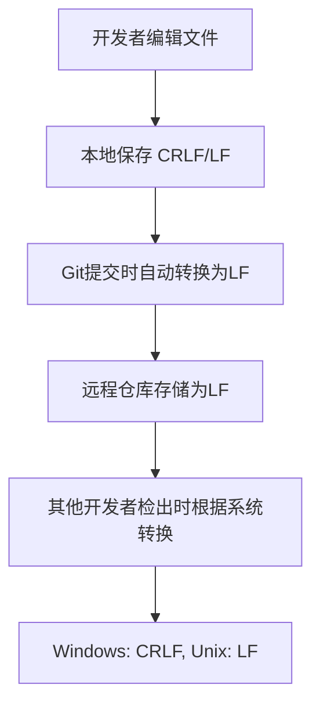

# Git 行尾配置说明

## 概述
此文档说明NocoDB Python SDK项目的Git行尾配置，确保无论开发者在什么操作系统上工作，提交到远程仓库的文件都使用统一的LF行尾格式。

## 配置详情

### 1. .gitattributes 文件
项目根目录下的`.gitattributes`文件定义了文件类型的行尾处理规则：

```gitattributes
# 自动检测文本文件，提交时转换为LF
* text=auto eol=lf

# 明确指定文本文件类型，强制使用LF行尾
*.py text eol=lf
*.md text eol=lf
*.txt text eol=lf
*.toml text eol=lf
*.json text eol=lf
*.yml text eol=lf
*.yaml text eol=lf
*.xml text eol=lf
*.html text eol=lf
*.css text eol=lf
*.js text eol=lf
*.ts text eol=lf
*.sql text eol=lf
*.sh text eol=lf
*.bat text eol=lf
*.ps1 text eol=lf
*.cfg text eol=lf
*.ini text eol=lf
*.conf text eol=lf

# 二进制文件：不进行行尾转换
*.png binary
*.jpg binary
*.jpeg binary
*.gif binary
*.ico binary
*.pdf binary
*.zip binary
*.exe binary
*.dll binary
*.so binary
*.pyc binary
*.pyd binary
*.egg binary
*.whl binary
```

### 2. Git 配置
项目级别的Git配置：

```bash
core.autocrlf=false
core.eol=lf
```

## 工作原理

### 行尾转换流程


### 配置说明
- **`text=auto`**: Git自动检测文本文件
- **`eol=lf`**: 强制使用LF行尾
- **`core.autocrlf false`**: 禁用自动CRLF转换
- **`core.eol lf`**: 设置行尾为LF

## 验证配置

### 验证方法
1. 检查Git配置：
   ```bash
   git config core.autocrlf
   git config core.eol
   ```

2. 检查文件行尾：
   - Windows: 使用`Format-Hex`命令查看文件十六进制
   - Unix: 使用`file`命令或`cat -A`查看行尾

### 预期结果
- Git配置：`core.autocrlf=false` 和 `core.eol=lf`
- 本地文件：可能包含CRLF或LF（取决于操作系统）
- 远程仓库：所有文本文件都使用LF行尾

## 跨平台兼容性

### Windows 开发者
- 本地文件可能使用CRLF行尾
- Git提交时自动转换为LF
- 检出时根据系统转换为CRLF

### Unix/Linux/macOS 开发者
- 本地文件使用LF行尾
- Git提交时保持LF格式
- 检出时保持LF格式

## 故障排除

### 常见问题
1. **行尾警告**：如果看到"CRLF will be replaced by LF"警告，这是正常现象，表示配置正在工作。

2. **文件格式问题**：如果文件在跨平台协作中出现格式问题，检查`.gitattributes`配置是否正确。

3. **二进制文件损坏**：确保二进制文件被正确标记为`binary`，避免行尾转换。

### 重置配置
如果需要重置配置，可以删除`.gitattributes`文件并重新配置Git设置：

```bash
git config --unset core.autocrlf
git config --unset core.eol
```

## 最佳实践

1. **新项目**：在项目初始化时就配置好行尾设置
2. **现有项目**：配置后进行一次性的行尾规范化提交
3. **团队协作**：确保所有团队成员使用相同的配置
4. **持续验证**：定期验证配置是否正常工作

## 参考链接
- [Git官方文档 - 行尾处理](https://git-scm.com/docs/gitattributes#_checking_out_and_checking_in)
- [Git官方文档 - 配置core.autocrlf](https://git-scm.com/book/en/v2/Customizing-Git-Git-Configuration#_code_core_autocrlf_code)