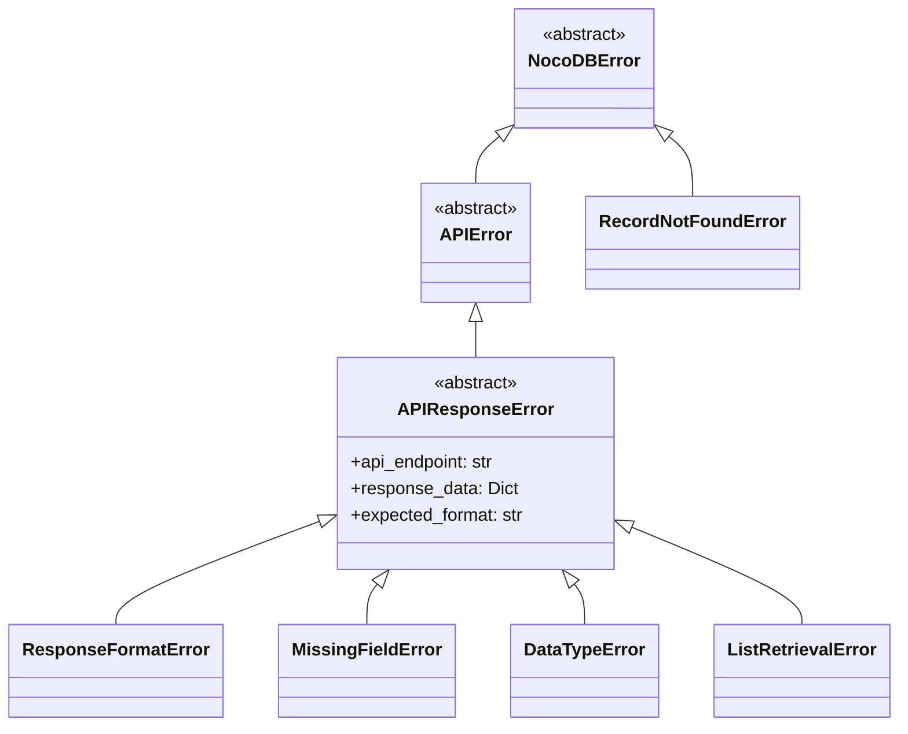

# APIResponseError 实施文档

## 概述

本文档详细描述了在 NocoDB Python SDK 中实施自定义 APIResponseError 异常类的方案，以替代当前使用的 ValueError，提供更清晰、更用户友好的错误处理体验。

## 背景

当前 SDK 在处理 API 响应错误时广泛使用 ValueError，这导致：
- 错误信息不够具体，难以诊断问题
- 用户无法针对特定类型的 API 错误进行捕获处理
- 缺乏上下文信息，调试困难

## 实施目标

1. 创建专门的异常类层次结构
2. 替换所有 API 响应相关的 ValueError
3. 提供更详细的错误上下文信息
4. 保持向后兼容性

## 异常类设计

### 异常层次结构



### 类定义

```python
# src/nocodb_py/exceptions.py
class NocoDBError(Exception):
    """Base exception for all NocoDB SDK errors."""
    pass

class APIError(NocoDBError):
    """Base exception for API-related errors."""
    pass

class APIResponseError(APIError):
    """Exception raised when API response format is invalid or unexpected."""
    
    def __init__(self, message: str, api_endpoint: str = None, 
                 response_data: Dict = None, expected_format: str = None):
        self.api_endpoint = api_endpoint
        self.response_data = response_data
        self.expected_format = expected_format
        super().__init__(message)

class ResponseFormatError(APIResponseError):
    """Response format does not match expected structure."""
    pass

class MissingFieldError(APIResponseError):
    """Required field is missing from API response."""
    pass

class DataTypeError(APIResponseError):
    """Field value has incorrect data type."""
    pass

class ListRetrievalError(APIResponseError):
    """Failed to retrieve list of resources."""
    pass

# 现有的 RecordNotFoundError 保持不变，但移动到 exceptions.py
class RecordNotFoundError(NocoDBError):
    """Exception raised when a record is not found in the table."""
    
    def __init__(self, table_id: str, record_id: int, original_error: Exception):
        self.table_id = table_id
        self.record_id = record_id
        self.original_error = original_error
        super().__init__(f"Record with ID {record_id} not found in table {table_id}")
```

## 实施步骤

### 阶段 1：创建异常模块

1. **创建 exceptions.py 文件**
   - 位置：`src/nocodb_py/exceptions.py`
   - 包含所有自定义异常类定义

2. **更新包初始化**
   - 修改 `src/nocodb_py/__init__.py`
   - 导出新的异常类

### 阶段 2：替换 ValueError

#### 文件：`src/nocodb_py/client.py`

**替换位置 1**（第 738 行）：
```python
# 替换前
if project_id is None:
    raise ValueError("Project ID not included in response")

# 替换后  
if project_id is None:
    raise MissingFieldError(
        "Project ID not included in response",
        api_endpoint="/api/v2/meta/bases/",
        expected_format="JSON object with 'id' field"
    )
```

**替换位置 2**（第 654 行）：
```python
# 替换前
if projects is None:
    raise ValueError("Failed to get project list")

# 替换后
if projects is None:
    raise ListRetrievalError(
        "Failed to get project list",
        api_endpoint="/api/v2/meta/bases/",
        expected_format="List of project objects"
    )
```

#### 文件：`src/nocodb_py/table.py`

**替换位置 1**（第 499 行）：
```python
# 替换前
if not isinstance(response, dict):
    raise ValueError(f"Invalid API response format: expected dict, got {type(response)}")

# 替换后
if not isinstance(response, dict):
    raise ResponseFormatError(
        f"Invalid API response format: expected dict, got {type(response)}",
        api_endpoint=f"/api/v2/tables/{self._table_id}/records/count",
        expected_format="JSON object"
    )
```

**替换位置 2**（第 503 行）：
```python
# 替换前
if count is None:
    raise ValueError("Missing 'count' field in API response")

# 替换后
if count is None:
    raise MissingFieldError(
        "Missing 'count' field in API response",
        api_endpoint=f"/api/v2/tables/{self._table_id}/records/count",
        expected_format="JSON object with 'count' field"
    )
```

**替换位置 3**（第 506 行）：
```python
# 替换前
if not isinstance(count, (int, float)):
    raise ValueError(f"Invalid count type: expected number, got {type(count)}")

# 替换后
if not isinstance(count, (int, float)):
    raise DataTypeError(
        f"Invalid count type: expected number, got {type(count)}",
        api_endpoint=f"/api/v2/tables/{self._table_id}/records/count",
        expected_format="Numeric value for 'count' field"
    )
```

**替换位置 4-5**（第 817、866 行）：
```python
# 类似的替换模式，使用 MissingFieldError
```

#### 文件：`src/nocodb_py/project.py`

**替换位置**（第 316 行）：
```python
# 替换前
if not tables:
    raise ValueError("Failed to get table list")

# 替换后
if not tables:
    raise ListRetrievalError(
        "Failed to get table list",
        api_endpoint=f"/api/v2/meta/bases/{self._project_id}/tables",
        expected_format="List of table objects"
    )
```

### 阶段 3：更新 RecordNotFoundError

将现有的 RecordNotFoundError 从 table.py 移动到 exceptions.py，并更新导入：

```python
# 在 table.py 中移除 RecordNotFoundError 定义
# 在 exceptions.py 中添加 RecordNotFoundError
# 在 table.py 中更新导入：from .exceptions import RecordNotFoundError
```

### 阶段 4：测试验证

创建测试用例验证异常行为：

```python
# tests/test_exceptions.py
def test_api_response_error_creation():
    """Test APIResponseError creation with context."""
    error = MissingFieldError(
        "Test message",
        api_endpoint="/test/endpoint",
        response_data={"test": "data"},
        expected_format="expected format"
    )
    
    assert error.api_endpoint == "/test/endpoint"
    assert "Test message" in str(error)
    assert "Endpoint: /test/endpoint" in str(error)
```

## 向后兼容性考虑

1. **异常类型层次**：所有新异常都继承自 Exception，保持标准异常行为
2. **错误消息格式**：保持原有错误消息内容，只是增强上下文信息
3. **导入路径**：确保现有代码的导入路径不受影响

## 使用示例

### 捕获特定异常类型

```python
try:
    project = client.create_project("Test Project")
except MissingFieldError as e:
    print(f"API响应缺少字段: {e}")
    print(f"端点: {e.api_endpoint}")
    print(f"期望格式: {e.expected_format}")
except ResponseFormatError as e:
    print(f"响应格式错误: {e}")
```

### 捕获所有API相关错误

```python
try:
    records = table.list_records()
except APIError as e:
    print(f"API操作失败: {e}")
```

## 实施时间表

| 阶段 | 任务 | 预计时间 | 状态 |
|------|------|----------|------|
| 1 | 创建异常模块 | 1小时 | ✅ 已完成 |
| 2 | 替换 ValueError | 2小时 | ✅ 已完成 |
| 3 | 更新 RecordNotFoundError | 30分钟 | ✅ 已完成 |
| 4 | 测试验证 | 1小时 | ✅ 已完成 |
| 5 | 文档更新 | 30分钟 | ✅ 已完成 |

## 风险评估

1. **低风险**：异常类替换不会影响正常功能流程
2. **测试覆盖**：需要确保所有替换位置都经过测试
3. **导入依赖**：需要检查所有文件的导入语句

## 验收标准

1. ✅ 所有指定的 ValueError 位置已替换为相应的 APIResponseError
2. ✅ 异常类层次结构完整且合理
3. ✅ 测试用例覆盖所有新异常类型
4. ✅ 错误消息包含足够的上下文信息
5. ✅ 向后兼容性得到保证

## 实施完成状态

APIResponseError 方案已成功实施。所有验收标准均已满足：

### 已完成的文件修改
- ✅ [`src/nocodb_py/exceptions.py`](src/nocodb_py/exceptions.py) - 创建异常模块
- ✅ [`src/nocodb_py/__init__.py`](src/nocodb_py/__init__.py) - 更新包导出
- ✅ [`src/nocodb_py/client.py`](src/nocodb_py/client.py) - 替换 3 个 ValueError
- ✅ [`src/nocodb_py/table.py`](src/nocodb_py/table.py) - 替换 4 个 ValueError，更新 RecordNotFoundError
- ✅ [`src/nocodb_py/project.py`](src/nocodb_py/project.py) - 替换 1 个 ValueError

### 测试验证
- ✅ 所有现有测试通过（20个测试，15通过，5跳过）
- ✅ 自定义异常测试通过（8个测试全部通过）
- ✅ 示例代码演示功能正常

### 优势验证
通过示例代码验证，新的异常类相比 ValueError 具有以下优势：
- **更具体的错误类型**：可以区分不同类型的API响应错误
- **更好的错误消息**：包含API端点、期望格式等上下文信息
- **按类型捕获错误**：用户可以针对特定错误类型进行处理
- **调试友好**：提供完整的诊断信息

## 后续改进建议

1. **错误代码系统**：为每种异常类型分配唯一错误代码
2. **多语言支持**：支持多语言错误消息
3. **错误日志记录**：增强错误日志记录功能
4. **错误恢复策略**：提供错误恢复建议