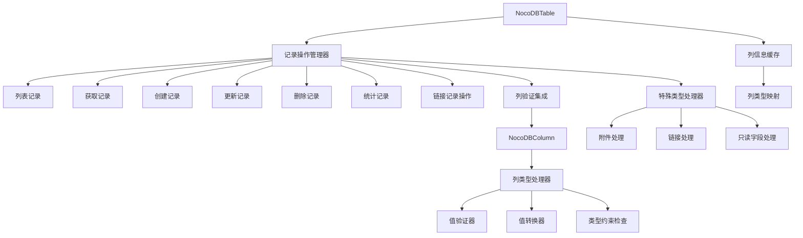

# NocoDB Python SDK 记录操作实现方案

## 项目概述

本方案旨在为NocoDB Python SDK实现完整的记录操作功能，包括基础的CRUD操作、列类型验证和特殊类型处理。方案基于NocoDB API V2数据操作接口规范，提供类型安全、性能优化的记录管理功能。

## 当前状态分析

### 现有代码基础
- [`table.py`](../src/nocodb_py/table.py)：已实现基础架构和HTTP方法，缺少记录操作功能
- [`column.py`](../src/nocodb_py/column.py)：目前只是基础框架，需要扩展列类型处理功能
- API文档：提供了完整的V2数据操作接口规范

### 功能缺口
- 缺少记录CRUD操作（列表、创建、更新、删除、获取单个记录）
- 缺少列类型验证和转换系统
- 缺少特殊类型（附件、链接、只读字段）处理
- 缺少记录操作的缓存策略

## 架构设计

### 核心组件关系


### API端点映射
```mermaid
graph LR
    A[记录操作] --> A1[GET /api/v2/tables/{id}/records]
    A --> A2[GET /api/v2/tables/{id}/records/{id}]
    A --> A3[POST /api/v2/tables/{id}/records]
    A --> A4[PATCH /api/v2/tables/{id}/records]
    A --> A5[DELETE /api/v2/tables/{id}/records]
    A --> A6[GET /api/v2/tables/{id}/records/count]
```

## 实施计划

### 第一阶段：基础记录操作（优先级：高）

#### 1.1 扩展NocoDBTable类
在 [`table.py`](../src/nocodb_py/table.py) 中添加以下方法：

```python
def list_records(self, fields=None, sort=None, where=None, 
                offset=0, limit=25, view_id=None, force_refresh=False)
def get_record(self, record_id, fields=None)
def create_records(self, records, validate=True, skip_validation_errors=False)
def update_records(self, records, validate=True, skip_validation_errors=False)
def delete_records(self, record_ids)
def count_records(self, view_id=None, where=None)
```

#### 1.2 基础列类型框架
在 [`column.py`](../src/nocodb_py/column.py) 中添加：

```python
def validate_value(self, value) -> Tuple[bool, str]
def convert_value(self, value) -> Any
def get_column_type(self) -> str
def is_readonly(self) -> bool
```

#### 1.3 简单类型验证
实现基础列类型的验证：
- 单行文本 (SingleLineText)
- 长文本 (LongText) 
- 数字 (Number)
- 日期 (Date)
- 时间 (Time)
- 日期时间 (DateTime)
- 复选框 (Checkbox)

### 第二阶段：高级功能（优先级：中）

#### 2.1 特殊类型处理
- **附件类型**：先上传附件，再引用附件信息
- **链接类型**：使用专门的链接API进行操作
- **只读字段**：自动忽略创建/更新操作中的只读字段

#### 2.2 高级列类型验证
实现复杂列类型的验证：
- 下拉选择 (SingleSelect, MultiSelect)
- 邮箱 (Email)
- URL
- 电话号码 (PhoneNumber)
- 货币 (Currency)
- 百分比 (Percent)
- 评分 (Rating)
- JSON
- 几何 (Geometry)

#### 2.3 缓存策略优化
- 列信息缓存：长时间缓存（TTL=3600秒）
- 记录数据缓存：短时间缓存（TTL=60秒）或禁用
- 智能刷新机制

### 第三阶段：测试和优化（优先级：低）

#### 3.1 测试用例
- 单元测试：列类型验证、值转换
- 集成测试：完整的CRUD操作流程
- 性能测试：批量操作和缓存效果

#### 3.2 错误处理完善
- 验证错误的详细反馈
- API错误的统一处理
- 业务逻辑错误的异常类型

#### 3.3 文档更新
- API使用示例
- 列类型约束说明
- 错误处理指南

## 详细设计

### 记录操作方法签名

#### 列表记录
```python
def list_records(self, 
                fields: Optional[str] = None,
                sort: Optional[str] = None, 
                where: Optional[str] = None,
                offset: int = 0,
                limit: int = 25,
                view_id: Optional[str] = None,
                force_refresh: bool = False) -> Dict[str, Any]
```

#### 创建记录
```python
def create_records(self,
                  records: List[Dict[str, Any]],
                  validate: bool = True,
                  skip_validation_errors: bool = False) -> List[Dict[str, Any]]
```

#### 更新记录  
```python
def update_records(self,
                  records: List[Dict[str, Any]],
                  validate: bool = True,
                  skip_validation_errors: bool = False) -> List[Dict[str, Any]]
```

### 列类型验证系统

#### 验证器接口
```python
class ColumnValidator:
    def validate(self, value: Any, column_info: Dict) -> ValidationResult
    def convert(self, value: Any, column_info: Dict) -> Any
```

#### 验证结果
```python
@dataclass
class ValidationResult:
    is_valid: bool
    error_message: str = ""
    converted_value: Any = None
```

### 特殊类型处理策略

#### 附件类型
1. 检查值是否为有效的附件对象数组
2. 支持URL上传和文件上传两种方式
3. 自动处理附件元数据（mimetype, size, title等）

#### 链接类型
1. 使用专门的链接API端点
2. 支持一对一、一对多、多对多关系
3. 自动处理链接记录的ID映射

#### 只读字段
1. 自动识别系统字段（CreatedBy, UpdatedBy等）
2. 在创建/更新操作中自动过滤
3. 提供明确的错误提示

## 技术决策

### 列类型映射表
| 列类型 | Python类型 | 验证规则 | 特殊处理 |
|--------|------------|----------|----------|
| SingleLineText | str | 长度限制 | 无 |
| LongText | str | 无限制 | 无 |
| Number | int/float | 数值范围 | 无 |
| Date | datetime.date | 日期格式 | 格式转换 |
| DateTime | datetime.datetime | 日期时间格式 | 时区处理 |
| Checkbox | bool | 布尔值 | 无 |
| Attachment | List[Dict] | 附件对象结构 | 上传处理 |
| Link | Dict/List | 链接ID验证 | 专用API |

### 错误处理策略
- **ValidationError**：列值验证失败
- **APIError**：HTTP请求失败
- **BusinessLogicError**：业务规则违反
- **CacheError**：缓存操作失败

### 性能优化措施
- 批量操作减少API调用次数
- 列信息缓存减少元数据查询
- 可选的数据缓存提高读取性能
- 异步操作支持（未来扩展）

## 风险评估和缓解

### 技术风险
1. **列类型复杂性**：20+种列类型各有特殊约束
   - *缓解*：采用策略模式，每种类型独立处理

2. **API兼容性**：V2 API可能还在演进
   - *缓解*：设计灵活的架构，便于适配变化

3. **性能问题**：大量记录操作影响性能
   - *缓解*：实现批量操作和智能缓存

### 实施风险
1. **代码复杂度**：验证逻辑可能变得复杂
   - *缓解*：模块化设计，清晰的接口分离

2. **测试覆盖**：特殊类型测试难度大
   - *缓解*：模拟测试和集成测试结合

## 成功标准

### 功能完成度
- [ ] 支持所有基础记录操作（CRUD）
- [ ] 实现主要列类型的验证和转换
- [ ] 特殊类型（附件、链接）有基本支持框架
- [ ] 完整的错误处理和用户反馈
- [ ] 性能优化的缓存策略

### 质量指标
- [ ] 单元测试覆盖率 > 80%
- [ ] 集成测试覆盖主要场景
- [ ] 代码符合Pylint标准
- [ ] 类型提示完整准确

### 文档完整性
- [ ] API使用示例完整
- [ ] 列类型约束说明清晰
- [ ] 错误处理指南详细

## 时间规划

### 第一阶段（1-2周）
- 基础记录操作实现
- 简单列类型验证
- 基础测试用例

### 第二阶段（2-3周）  
- 高级列类型验证
- 特殊类型处理框架
- 缓存策略优化

### 第三阶段（1-2周）
- 测试完善
- 性能优化
- 文档更新

## 后续扩展

### 未来功能
- 异步操作支持
- 更高级的查询功能（复杂过滤、聚合）
- 数据导入导出
- 实时数据同步

### 架构演进
- 插件化列类型系统
- 可配置的验证规则
- 分布式缓存支持

---
*方案版本：1.0*  
*创建时间：2025-12-21*  
*最后更新：2025-12-21*