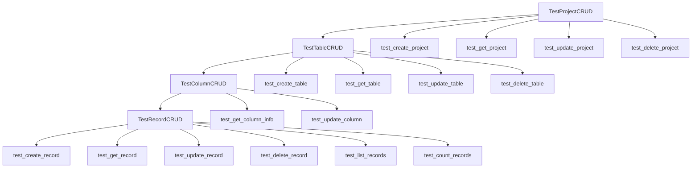

# NocoDB Python SDK 测试架构改进方案

## 问题分析

当前测试代码 `test_project_crud` 包含7个步骤，耗时较长，pytest无法提前获知每个步骤的结果。需要设计一个更好的测试架构来：

1. 提供步骤报告机制，让pytest能够提前获知每个步骤的结果
2. 支持分层测试架构（项目→表格→列→记录）
3. 实现测试数据管理和自动清理

## 解决方案设计

### 1. 步骤报告机制

使用装饰器模式实现步骤报告：

```python
def step_report(step_name):
    def decorator(func):
        def wrapper(*args, **kwargs):
            logger.info(f"[STEP START] {step_name}")
            try:
                result = func(*args, **kwargs)
                logger.info(f"[STEP COMPLETE] {step_name}")
                return result
            except Exception as e:
                logger.error(f"[STEP FAILED] {step_name}: {e}")
                raise
        return wrapper
    return decorator
```

### 2. 分层测试架构



### 3. 测试数据管理fixture

```python
@pytest.fixture
def test_project(client: NocoDBClient) -> NocoDBProject:
    """创建测试项目fixture"""
    project_name = generate_test_name("test_project")
    project = client.create_project(project_name, return_type='object')
    yield project
    # 自动清理
    client.delete_project(project.get_project_id())

@pytest.fixture
def test_table(test_project: NocoDBProject) -> NocoDBTable:
    """创建测试表格fixture"""
    table_name = generate_test_name("test_table")
    table = test_project.create_table(table_name)
    yield table
    # 自动清理
    test_project.delete_table(table.get_table_id())
```

### 4. 测试类设计

#### TestProjectCRUD 类
- `test_create_project`: 测试项目创建
- `test_get_project`: 测试项目读取
- `test_update_project`: 测试项目更新
- `test_delete_project`: 测试项目删除

#### TestTableCRUD 类
- `test_create_table`: 测试表格创建
- `test_get_table`: 测试表格读取
- `test_update_table`: 测试表格更新
- `test_delete_table`: 测试表格删除

#### TestColumnCRUD 类
- `test_get_column_info`: 测试列信息读取
- `test_update_column`: 测试列更新（部分功能）

#### TestRecordCRUD 类
- `test_create_record`: 测试记录创建
- `test_get_record`: 测试记录读取
- `test_update_record`: 测试记录更新
- `test_delete_record`: 测试记录删除
- `test_list_records`: 测试记录列表
- `test_count_records`: 测试记录统计

### 5. 集成测试

```python
class TestIntegratedCRUD:
    """集成CRUD测试 - 模拟完整业务流程"""
    
    def test_complete_workflow(self, client: NocoDBClient):
        # 1. 创建项目
        project = client.create_project("test_project", return_type='object')
        # 2. 创建表格
        table = project.create_table("test_table")
        # 3. 创建记录
        record = table.create_records([{"Title": "Test"}], return_type='object')
        # 4. 验证记录
        retrieved_record = table.get_record(record.get_id(), return_type='object')
        # 5. 清理
        project.delete_table(table.get_table_id())
        client.delete_project(project.get_project_id())
```

## 优势

1. **步骤可见性**: 每个测试步骤都有明确的开始和完成标记
2. **独立测试**: 每个CRUD操作都是独立的测试方法，便于调试
3. **数据隔离**: 使用fixture确保测试数据隔离和自动清理
4. **分层架构**: 支持项目→表格→列→记录的自然层次结构
5. **错误处理**: 每个步骤都有独立的错误处理和报告

## 实施计划

1. 创建 `tests/test_architecture_improved.py` 文件
2. 实现步骤报告装饰器
3. 实现测试数据管理fixture
4. 实现分层测试类
5. 验证测试架构的可行性

## 注意事项

- 列CRUD功能目前部分实现，需要等待NocoDBColumn类的create_column方法
- 测试数据清理需要处理异常情况
- 集成测试需要确保正确的清理顺序